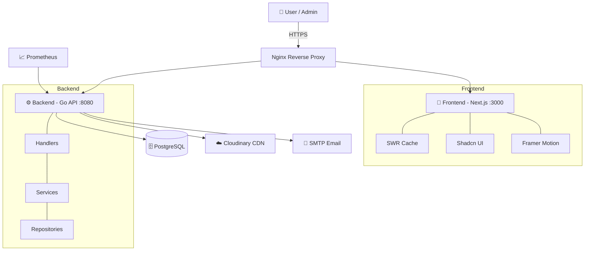

<p align="center">
  <h1 align="center">🏡 Platform Kos</h1>
  <p align="center">
    <strong>Sistem Manajemen Kos-Kosan Modern — Full-Stack, Aman, dan Siap Produksi</strong>
  </p>
  <p align="center">
    <a href="https://golang.org"></a>
    <a href="https://nextjs.org"></a>
    <a href="https://www.postgresql.org"></a>
    <a href="https://docker.com"></a>
    <a href="https://tailwindcss.com"></a>
  </p>
</p>

---

**Platform Kos** adalah aplikasi manajemen kos-kosan full-stack yang memadukan backend **Go (Gin + GORM)** dengan Clean Architecture dan frontend **Next.js (App Router)** yang modern. Dirancang untuk pengelola kos yang ingin mendigitalkan operasionalnya — dari pengelolaan kamar, booking, pembayaran, hingga dashboard analitik.

## ✨ Fitur Utama

### 🔐 Security & Authentication
- **HttpOnly Cookie JWT** — Token tidak bisa diakses JavaScript (anti-XSS)
- **Refresh Token Rotation** — Auto-rotate tanpa logout
- **Google OAuth 2.0** — Login cepat via akun Google
- **Role-Based Access Control** — Admin & Penyewa dengan permission terpisah
- **Rate Limiting** — Brute-force protection pada endpoint sensitif
- **IDOR Protection** — Ownership check pada setiap resource

### 🏠 Room Management
- CRUD kamar dengan upload gambar via **Cloudinary CDN**
- Status tracking: `Tersedia` → `Booked` → `Terisi` → `Perbaikan`
- Detail kamar lengkap: tipe, fasilitas, lantai, ukuran, harga

### 📋 Booking System
- Booking flow intuitif dengan **atomic database transactions**
- Auto-cancel booking yang expired (background worker)
- Perpanjangan sewa langsung dari dashboard
- Status tracking: `Pending` → `Confirmed` → `Active` → `Completed`

### � Payment
- **Transfer Bank** — Upload bukti bayar + admin konfirmasi
- **Cash** — Pencatatan pembayaran tunai oleh admin
- Opsi **Full Payment** atau **DP (Down Payment)**
- **Automated Payment Reminders** via email

### 📊 Admin Dashboard
- Revenue analytics & tren bulanan (Recharts)
- Statistik okupansi real-time
- Konfirmasi pembayaran & manajemen penyewa
- Monitoring Prometheus terintegrasi

### 🎨 User Experience
- **SWR Caching** — Data tampil instan, refresh di background
- **Glassmorphism + Dark Mode** — UI modern dan premium
- **Fully Responsive** — Mobile-first design
- **Framer Motion** — Micro-animations untuk interaksi halus

---

## 🏗️ Arsitektur Sistem



---

## 📁 Struktur Proyek

```
platfrom-kos/
├── be/                          # Backend (Go)
│   ├── cmd/api/main.go          # Entry point
│   ├── internal/
│   │   ├── config/              # Environment configuration
│   │   ├── database/            # PostgreSQL + GORM setup
│   │   ├── models/              # 8 GORM models
│   │   ├── repository/          # Data access layer (7 repos)
│   │   ├── service/             # Business logic (11 services)
│   │   ├── handlers/            # HTTP transport (11 handlers)
│   │   ├── middleware/          # Auth, rate limit, error handling
│   │   ├── routes/              # Route registration
│   │   ├── scheduler/           # Background jobs (cron)
│   │   └── utils/               # JWT, Cloudinary, Email helpers
│   ├── Dockerfile
│   └── Makefile
│
├── fe/                          # Frontend (Next.js)
│   ├── app/
│   │   ├── components/
│   │   │   ├── admin/           # Admin dashboard components
│   │   │   ├── tenant/          # Tenant-facing components
│   │   │   ├── shared/          # Reusable components
│   │   │   └── ui/              # Shadcn UI (25+ components)
│   │   ├── context/             # AppContext, ThemeContext
│   │   ├── services/api.ts      # API client (single source of truth)
│   │   └── ...pages
│   └── middleware.ts            # Route protection
│
├── docs/                        # � Technical documentation (GitBook)
│   ├── getting-started/         # Setup & intro
│   ├── architecture/            # System design & database
│   ├── security/                # Auth & security guidelines
│   ├── features/                # API ref, core features, frontend
│   ├── devops/                  # Docker, CI/CD, deployment
│   └── reference/               # Database schema
│
├── nginx/                       # Nginx reverse proxy config
├── docker-compose.yml           # Full stack orchestration
└── deploy.sh                    # Production deployment script
```

---

## 🚀 Quick Start

### Prasyarat

| Tool | Versi | Keterangan |
|------|-------|------------|
| **Go** | 1.24+ | Backend runtime |
| **Node.js** | 18+ | Frontend runtime |
| **PostgreSQL** | 15+ | Database |
| **Docker** *(opsional)* | 24+ | Untuk deployment |

### Option 1: Local Development

```bash
# 1. Clone
git clone https://github.com/your-username/platfrom-kos.git
cd platfrom-kos

# 2. Setup Database
createdb koskosan_db

# 3. Backend
cd be
cp .env.example .env      # Edit: DB_PASSWORD, JWT_SECRET (min 32 chars)
go mod tidy
go run cmd/api/main.go     # → http://localhost:8081

# 4. Frontend (terminal baru)
cd fe
cp .env.example .env.local # Edit: NEXT_PUBLIC_API_URL=http://localhost:8081/api
npm install
npm run dev                # → http://localhost:3000
```

### Option 2: Docker Compose

```bash
# Satu perintah untuk seluruh stack
docker compose up --build -d

# Akses
# Frontend: http://localhost
# Backend:  http://localhost:8080
# Database: localhost:5432
```

> 📖 **Tutorial lengkap** → [docs/getting-started/project-setup.md](docs/getting-started/project-setup.md)

---

## �️ Tech Stack

| Layer | Teknologi |
|-------|-----------|
| **Backend** | Go 1.24, Gin, GORM, golang-jwt/v5 |
| **Frontend** | Next.js 16, React 18, TypeScript, SWR |
| **Database** | PostgreSQL 15 |
| **Styling** | Tailwind CSS 4, Shadcn UI, Framer Motion |
| **Auth** | JWT (HttpOnly Cookie), Google OAuth 2.0 |
| **Storage** | Cloudinary CDN |
| **Infra** | Docker, Nginx, Prometheus, GitHub Actions |

---

## 🗺️ Roadmap

- [x] 🏠 Room Management (CRUD + Cloudinary)
- [x] 📋 Booking System (Atomic Transactions)
- [x] � Payment (Transfer + Cash + DP)
- [x] 🔐 Enterprise Security (HttpOnly JWT + OAuth + RBAC)
- [x] 📊 Admin Dashboard (Revenue Analytics)
- [x] 📧 Payment Reminders (Email)
- [x] 📚 Technical Documentation (GitBook)
- [ ] 💬 In-App Chat System
- [ ] 📱 Mobile Companion App (React Native)
- [ ] 🤖 AI-Powered Pricing Recommendations
- [ ] 🌐 Multi-Property Support

---

## 📚 Dokumentasi

Dokumentasi lengkap tersedia di folder [`docs/`](docs/) dan didesain untuk integrasi **GitBook**:

| Section | Konten |
|---------|--------|
| [Getting Started](docs/getting-started/) | Introduction, Tech Stack, Project Setup |
| [Architecture](docs/architecture/) | Clean Architecture, Database & ERD |
| [Security](docs/security/) | JWT, OAuth, RBAC, Rate Limiting |
| [Features](docs/features/) | 30+ API Endpoints, Core Features, Frontend |
| [DevOps](docs/devops/) | Docker, CI/CD, Prometheus, Deployment |

---

## 📄 Lisensi

Didistribusikan di bawah **MIT License**. Lihat [LICENSE](LICENSE) untuk informasi lebih lanjut.

---

<p align="center">
  <sub>Built with ☕ in Malang — <strong>Platform Kos</strong>, Home Away from Home.</sub>
</p>
