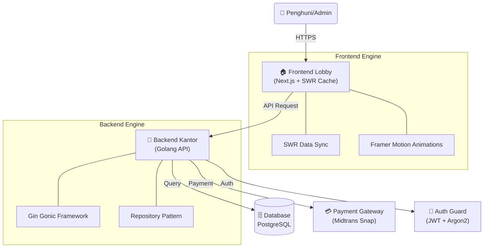

# 🏡 Kost Putra Rahmat ZAW - Management System

> _Sistem Manajemen Kos Putra Paling Modern, Kencang, dan Aman di Malang!_

[](https://golang.org)
[](https://nextjs.org)
[](https://www.postgresql.org)
[](https://swr.vercel.app)
[](https://docker.com)
[](https://tailwindcss.com)

Selamat datang di repo **Kost Putra Rahmat ZAW**! 😎  
Bukan sekedar aplikasi, ini adalah platform premium buat penghuni dan pengelola kos yang mengutamakan kecepatan (SWR), keamanan (Midtrans Integration + Secure Auth), dan kenyamanan UI (Modern Web Design).

---

## 🗺️ Meluncur di Arsitektur Modern

Aplikasi ini menggunakan arsitektur modern yang memisahkan antara frontend dan backend (Decoupled Architecture).



---

## ✨ Fitur Unggulan (Premium Features)

### 🎨 Frontend (The User Experience)

- **⚡ Zero-Loading Navigation**: Berkat **SWR**, data di-cache otomatis. Pindah tab? Instan!
- **💎 Glassmorphism UI**: Tampilan modern dengan efek transparansi & blur yang premium menggunakan **Tailwind CSS**.
- **🎭 Smooth Animations**: Interaksi halus saat buka modal atau transisi halaman via **Framer Motion**.
- **📱 Ultra Responsive**: Nyaman dibuka dari HP Android, iPhone, sampai monitor gaming jumbo.
- **🌙 Theme Switcher**: Dukungan penuh Dark Mode & Light Mode yang elegan.
- **💸 Pembayaran Mudah**: Integrasi langsung dengan **Midtrans** untuk pembayaran otomatis dan konfirmasi instan.

### ⚙️ Backend (The Powerhouse)

- **🏎️ High Performance**: Ditenagai **Go** dengan kompilasi super cepat.
- **🗄️ Relational Database**: Menggunakan **PostgreSQL** untuk integritas data yang kuat (booking, user, payment).
- **🔐 Security First**: CORS policy ketat, password hashing yang aman, dan JWT authentication.
- **💳 Payment Automation**: Verifikasi pembayaran otomatis (Midtrans) sehingga status kamar langsung terupdate.
- **🏢 Clean Architecture**: Menggunakan pattern `Handler -> Service -> Repository` yang mudah dirawat.
- **📝 Live Documentation**: Dokumentasi API interaktif menggunakan **Swagger UI**.

---

## 📁 Struktur Bangunan (Folders)

```text
/
├── be/                 # 🏗️ Backend (Golang Engine)
│   ├── cmd/            # Entry point (main.go)
│   ├── internal/       # Core logic (Handlers, Services, Repos)
│   └── docs/           # API Docs (Swagger)
├── fe/                 # 🎨 Frontend (Next.js Application)
│   ├── app/            # Pages & Components
│   ├── context/        # Global State (Login, Theme)
│   └── services/       # API integration logic
├── compose.yaml        # 🐳 Blueprint Docker (One-click setup)
└── README.md           # 📍 Peta Utama
```

---

## 🚀 Cara Mulai (Getting Started)

### 📋 Prasyarat

- **PostgreSQL** (Installed & Running)
- **Node.js 18+**
- **Go 1.22+**
- **Midtrans Account** (Sandbox/Production Keys)

### 📦 Setup Database

Pastikan buat database bernama `tugas_arkan` (atau sesuai `.env`) di PostgreSQL Anda.

### 🛠️ Jalur Tukang (Development)

#### **1. Backend (`/be`)**

Konfigurasi `.env`:
Salin `be/.env.example` ke `be/.env` dan isi kredensial DB serta Midtrans Anda.

```bash
cd be
# Install dependencies
go mod tidy

# Jalankan server
go run cmd/api/main.go
```
*Server berjalan di port 8081*

#### **2. Frontend (`/fe`)**

Konfigurasi `.env`:
Buat file `fe/.env` jika perlu kustomisasi URL API.

```bash
cd fe
# Install paket
npm install

# Jalankan mode dev
npm run dev
```
*Akses di http://localhost:3000*

---

## 🛣️ Rencana Renovasi (Roadmap)

- [x] 💳 **Otomatisasi Pembayaran**: Integrasi Midtrans sukses!
- [x] 🔒 **Keamanan**: Auth dengan JWT dan Google OAuth.
- [ ] 💬 **In-App Messaging**: Chat langsung antara penyewa dan admin.
- [ ] 📅 **Kalender Pintar**: Notifikasi jatuh tempo sewa otomatis via WhatsApp.
- [ ] 📊 **Dashboard Juragan**: Laporan keuangan lengkap dalam hitungan detik.

---

## 📄 Lisensi

Distribusi di bawah **MIT License**. Silakan pakai dan modifikasi, tapi jangan lupa bawa martabak ke Malang ya! 😉

---

> _Dibuat di Malang. Kost Putra Rahmat ZAW - Home away from home._
