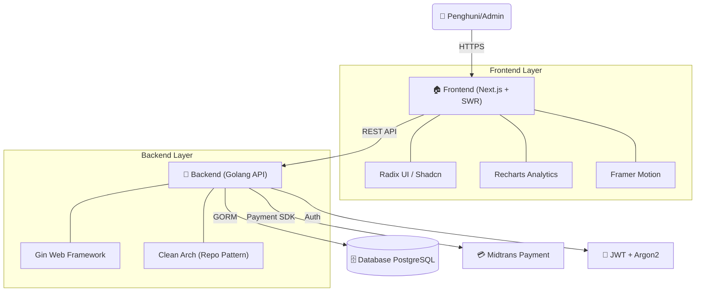

# 🏡 Kost Putra Rahmat ZAW - Management System

> _Sistem Manajemen Kos Putra Premium: Modern, Cepat, dan Skalabel._

[](https://golang.org)
[](https://nextjs.org)
[](https://www.postgresql.org)
[](https://swr.vercel.app)
[](https://docker.com)
[](https://tailwindcss.com)

**Kost Putra Rahmat ZAW** adalah platform manajemen kos terintegrasi yang dirancang untuk memberikan pengalaman terbaik bagi penghuni dan efisiensi maksimal bagi manajemen. Memadukan arsitektur **Clean Architecture (Golang)** yang tangguh dengan antarmuka **Next.js** yang elegan.

---

## 🏗️ Arsitektur Sistem

Proyek ini mengimplementasikan **Decoupled Architecture** untuk memastikan skalabilitas dan performa tinggi.



---

## ✨ Fitur Utama

### 🛡️ Keamanan & Autentikasi Modern
- **Google OAuth 2.0 Integration**: Login cepat dan aman menggunakan akun Google.
- **Robust JWT Auth**: Manajemen sesi yang aman dengan JSON Web Tokens.
- **Secure Password Reset**: Sistem reset password berbasis email yang terenkripsi.
- **Argon2 Hashing**: Standar hashing password tingkat industri.

### 📊 Luxury Admin Dashboard
- **Real-time Analytics**: Visualisasi tren pendapatan dan statistik okupansi menggunakan **Recharts**.
- **Financial Reports**: Laporan keuangan mendetail (Total Revenue, Pending Payments, Potential Revenue).
- **Metric Dashboard**: Monitoring penyewa aktif, kamar tersedia, dan performa pembayaran secara instan.
- **Auto-Refresh**: Data yang selalu mutakhir dengan sistem sinkronisasi otomatis.

### 💸 Sistem Pembayaran & Booking
- **Midtrans Snap Integration**: Pembayaran otomatis melalui berbagai kanal (VA, E-Wallet, Kartu Kredit).
- **Automated Status Update**: Status kamar otomatis berubah setelah pembayaran terkonfirmasi.
- **Booking Flow**: Proses pemesanan kamar yang intuitif dengan validasi ketersediaan real-time.

### 🎨 User Experience (UX)
- **⚡ Zero-Loading UI**: Optimasi navigasi dengan caching **SWR**.
- **💎 Glassmorphism Design**: Antarmuka modern dengan efek blur dan transparansi yang premium.
- **📱 Responsive Layout**: Dioptimalkan secara penuh untuk perangkat mobile hingga desktop.
- **🌙 Dynamic Theming**: Dukungan Dark Mode dan Light Mode yang elegan.

---

## 📁 Struktur Proyek

```text
/
├── be/                 # 🏗️ Backend (Golang Engine)
│   ├── cmd/            # Entry point aplikasi
│   ├── internal/       # Business Logic (Handlers, Services, Repositories)
│   └── utils/          # Helper & Validation tools
├── fe/                 # 🎨 Frontend (Next.js Application)
│   ├── app/            # App Router (Pages & Components)
│   ├── context/        # State Management
│   └── services/       # API Consumer Layer
├── docs/               # 📍 Dokumentasi Teknis
└── compose.yaml        # 🐳 Docker Infrastructure Blueprint
```

---

## 🚀 Instalasi Cepat

### Prasyarat
- PostgreSQL 15+
- Node.js 18+
- Go 1.24+

### Setup Local
1. **Database**: Buat database bernama `koskosan_db`.
2. **Backend**: 
   ```bash
   cd be && go mod tidy
   go run cmd/api/main.go
   ```
3. **Frontend**:
   ```bash
   cd fe && npm install
   npm run dev
   ```

---

## 🛣️ Roadmap Pengembangan

- [x] 🏦 **Automated Payment**: Integrasi Midtrans (Selesai).
- [x] 🔐 **Advanced Security**: JWT + Google OAuth + Password Reset (Selesai).
- [x] 📊 **Luxury Dashboard**: Analytics & Financial Reporting (Selesai).
- [ ] 💬 **Integrated Chat**: Sistem komunikasi in-app.
- [ ] 📱 **Mobile App**: Versi native Android/iOS.
- [ ] 🤖 **Smart Notifications**: Pengingat otomatis via WhatsApp/Email.

---

## 📄 Lisensi

Didistribusikan di bawah **MIT License**.

> _Handcrafted with coffe in Malang. Kost Putra Rahmat ZAW - Home away from home._
