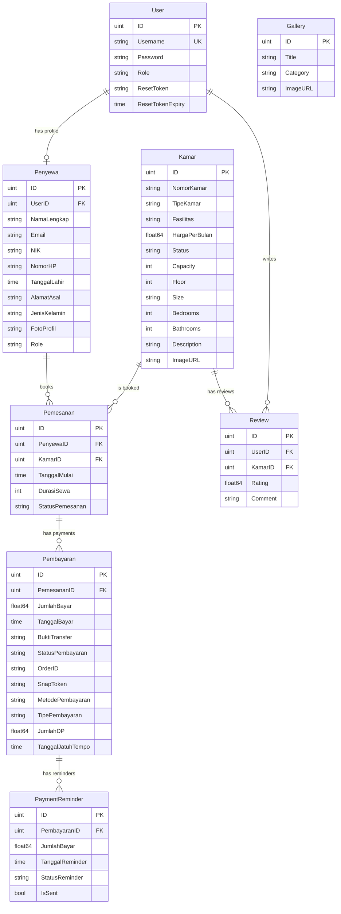

# Database

Dokumentasi lengkap schema database, model GORM, dan strategi migration.

## Database Engine

- **PostgreSQL 15** (Alpine) — Dijalankan via Docker atau instalasi lokal.
- **GORM v1.31.1** — ORM untuk Go dengan auto-migration, relationship, dan soft delete.
- **Timezone** — `Asia/Jakarta` (WIB)

## Koneksi Database

Konfigurasi koneksi dan connection pool dari `database.go`:

```go
// Dari be/internal/database/database.go

func InitDB(cfg *config.Config) {
    dsn := fmt.Sprintf(
        "host=%s user=%s password=%s dbname=%s port=%s sslmode=disable TimeZone=Asia/Jakarta",
        cfg.DBHost, cfg.DBUser, cfg.DBPassword, cfg.DBName, cfg.DBPort,
    )
    DB, err = gorm.Open(postgres.Open(dsn), &gorm.Config{})

    // Connection Pool Optimization
    sqlDB, _ := DB.DB()
    sqlDB.SetMaxIdleConns(10)       // Reuse idle connections
    sqlDB.SetMaxOpenConns(100)      // Max concurrent connections
    sqlDB.SetConnMaxLifetime(time.Hour) // Prevent stale connections

    // Auto Migration
    DB.AutoMigrate(
        &models.User{},
        &models.Kamar{},
        &models.Penyewa{},
        &models.Pemesanan{},
        &models.Pembayaran{},
        &models.Gallery{},
        &models.Review{},
        &models.PaymentReminder{},
    )
}
```

Sumber: [`be/internal/database/database.go`](file:///c:/Users/Arkan/Documents/coding/platfrom-kos/be/internal/database/database.go)

## Entity Relationship Diagram



## Model Definitions

Semua model didefinisikan di satu file [`be/internal/models/models.go`](file:///c:/Users/Arkan/Documents/coding/platfrom-kos/be/internal/models/models.go):

### User

```go
type User struct {
    ID        uint           `gorm:"primaryKey" json:"id"`
    Username  string         `gorm:"uniqueIndex" json:"username"`
    Password  string         `json:"-"`                  // Hidden dari JSON
    Role      string         `json:"role"`               // admin, penyewa
    CreatedAt        time.Time      `json:"created_at"`
    UpdatedAt        time.Time      `json:"updated_at"`
    DeletedAt        gorm.DeletedAt `gorm:"index" json:"-"`  // Soft delete
    ResetToken       string         `json:"-"`
    ResetTokenExpiry time.Time      `json:"-"`
}
```

### Kamar (Room)

```go
type Kamar struct {
    ID            uint           `gorm:"primaryKey" json:"id"`
    NomorKamar    string         `json:"nomor_kamar"`
    TipeKamar     string         `json:"tipe_kamar"`
    Fasilitas     string         `json:"fasilitas"`
    HargaPerBulan float64        `json:"harga_per_bulan"`
    Status        string         `json:"status"`       // Tersedia, Terisi, Booked, Perbaikan
    Capacity      int            `json:"capacity"`
    Floor         int            `json:"floor"`
    Size          string         `json:"size"`          // e.g. "3x4m"
    Bedrooms      int            `json:"bedrooms"`
    Bathrooms     int            `json:"bathrooms"`
    Description   string         `json:"description"`
    ImageURL      string         `json:"image_url"`
    // ... timestamps & soft delete
}
```

### Penyewa (Tenant Profile)

```go
type Penyewa struct {
    ID           uint           `gorm:"primaryKey" json:"id"`
    UserID       uint           `json:"user_id"`
    User         User           `gorm:"foreignKey:UserID" json:"user"`
    NamaLengkap  string         `json:"nama_lengkap"`
    Email        string         `json:"email"`
    NIK          string         `json:"nik"`
    NomorHP      string         `json:"nomor_hp"`
    TanggalLahir time.Time      `json:"tanggal_lahir"`
    AlamatAsal   string         `json:"alamat_asal"`
    JenisKelamin string         `json:"jenis_kelamin"`
    FotoProfil   string         `json:"foto_profil"`
    Role         string         `gorm:"default:guest" json:"role"` // guest, tenant, former_tenant
    // ... timestamps & soft delete
}
```

### Pemesanan (Booking)

```go
type Pemesanan struct {
    ID              uint             `gorm:"primaryKey" json:"id"`
    PenyewaID       uint             `json:"penyewa_id"`
    Penyewa         Penyewa          `gorm:"foreignKey:PenyewaID" json:"penyewa"`
    KamarID         uint             `json:"kamar_id"`
    Kamar           Kamar            `gorm:"foreignKey:KamarID" json:"kamar"`
    TanggalMulai    time.Time        `json:"tanggal_mulai"`
    DurasiSewa      int              `json:"durasi_sewa"`        // dalam bulan
    StatusPemesanan string           `json:"status_pemesanan"`   // Pending, Confirmed, Cancelled, Active, Completed
    Pembayaran      []Pembayaran     `gorm:"foreignKey:PemesananID" json:"-"`
    // ... timestamps & soft delete
}
```

### Pembayaran (Payment)

```go
type Pembayaran struct {
    ID               uint           `gorm:"primaryKey" json:"id"`
    PemesananID      uint           `json:"pemesanan_id"`
    Pemesanan        Pemesanan      `gorm:"foreignKey:PemesananID" json:"pemesanan"`
    JumlahBayar      float64        `json:"jumlah_bayar"`
    TanggalBayar     time.Time      `json:"tanggal_bayar"`
    BuktiTransfer    string         `json:"bukti_transfer"`
    StatusPembayaran string         `json:"status_pembayaran"` // Pending, Confirmed, Failed, Settled
    OrderID          string         `json:"order_id"`
    SnapToken        string         `json:"snap_token"`
    MetodePembayaran string         `json:"metode_pembayaran"` // midtrans, cash
    TipePembayaran   string         `json:"tipe_pembayaran"`   // full, dp
    JumlahDP         float64        `json:"jumlah_dp"`
    TanggalJatuhTempo time.Time     `json:"tanggal_jatuh_tempo"`
    // ... timestamps & soft delete
}
```

## Enum Values

| Model | Field | Nilai |
|-------|-------|-------|
| **User** | `Role` | `admin`, `penyewa` |
| **Kamar** | `Status` | `Tersedia`, `Terisi`, `Booked`, `Perbaikan` |
| **Penyewa** | `Role` | `guest`, `tenant`, `former_tenant` |
| **Pemesanan** | `StatusPemesanan` | `Pending`, `Confirmed`, `Cancelled`, `Active`, `Completed` |
| **Pembayaran** | `StatusPembayaran` | `Pending`, `Confirmed`, `Failed`, `Settled` |
| **Pembayaran** | `MetodePembayaran` | `midtrans`, `cash` |
| **Pembayaran** | `TipePembayaran` | `full`, `dp` |
| **PaymentReminder** | `StatusReminder` | `Pending`, `Paid`, `Expired` |

## Migration

GORM melakukan **auto-migration** saat server pertama kali start. Untuk migration SQL manual (misalnya menambah kolom baru), gunakan file di folder `be/migrations/`:

```bash
# Jalankan migration manual
cd be
bash run-migration.sh
# atau di Windows:
run-migration.bat
```

> [!IMPORTANT]
> Semua model menggunakan **soft delete** (`gorm.DeletedAt`). Data yang dihapus tidak benar-benar hilang dari database, hanya ditandai dengan timestamp `deleted_at`.

---

> [!NOTE]
> GORM akan otomatis membuat foreign key constraints berdasarkan tag `gorm:"foreignKey:..."` pada model.
