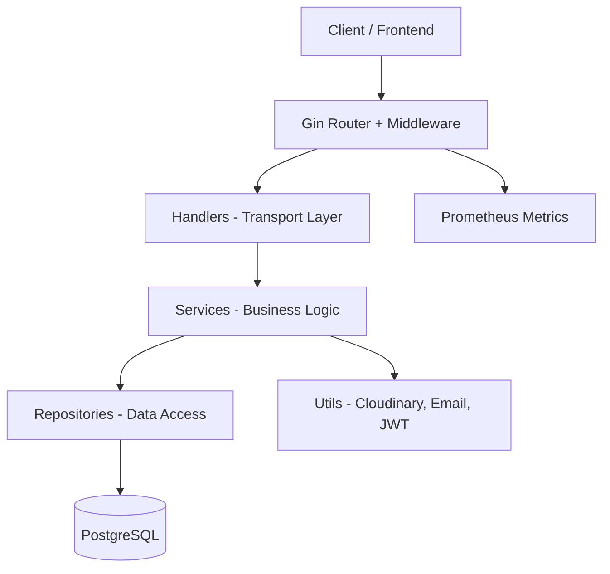
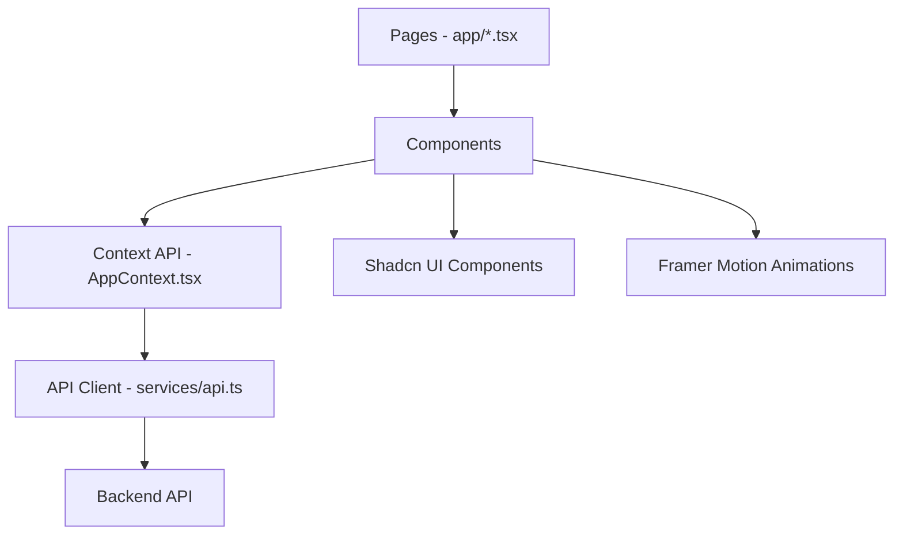

# Architecture

Platform Kos menggunakan **Clean Architecture** pada backend dan **Modular Hook-based** pattern pada frontend untuk menjamin skalabilitas dan maintainability.

## Backend: Clean Architecture

### Folder Structure

```
be/
├── cmd/
│   └── api/
│       └── main.go              # Entry point aplikasi
├── internal/
│   ├── config/
│   │   └── config.go            # Konfigurasi environment
│   ├── database/
│   │   └── database.go          # Koneksi & migration PostgreSQL
│   ├── models/
│   │   └── models.go            # Definisi GORM models
│   ├── repository/              # Data access layer
│   │   ├── user_repository.go
│   │   ├── kamar_repository.go
│   │   ├── penyewa_repository.go
│   │   ├── booking_repository.go
│   │   ├── payment_repository.go
│   │   ├── gallery_repository.go
│   │   └── review_repository.go
│   ├── service/                 # Business logic layer
│   │   ├── auth_service.go
│   │   ├── booking_service.go
│   │   ├── payment_service.go
│   │   ├── kamar_service.go
│   │   ├── dashboard_service.go
│   │   ├── profile_service.go
│   │   ├── reminder_service.go
│   │   └── ...
│   ├── handlers/                # HTTP transport layer
│   │   ├── auth_handler.go
│   │   ├── booking_handler.go
│   │   ├── payment_handler.go
│   │   ├── room_handler.go
│   │   ├── profile_handler.go
│   │   └── ...
│   ├── middleware/
│   │   ├── auth.go              # JWT & Role middleware
│   │   ├── rate_limit.go        # Rate limiting
│   │   └── error_handler.go     # Global error handling
│   ├── routes/
│   │   └── routes.go            # Route registration
│   ├── scheduler/               # Background jobs (cron)
│   ├── utils/                   # Helper functions
│   └── validators/              # Input validation
├── migrations/                  # SQL migration files
├── Dockerfile
├── Makefile
└── go.mod
```

### Layer Architecture



| Layer | Tanggung Jawab | Contoh |
|-------|---------------|--------|
| **Handlers** | Parsing HTTP request, validasi input, response | `auth_handler.go` |
| **Services** | Logika bisnis, orkestrasi repository | `booking_service.go` |
| **Repositories** | Operasi database via GORM | `kamar_repository.go` |
| **Middleware** | Auth, rate limit, error handling, CORS | `auth.go` |

### Dependency Injection di `main.go`

Semua layer diinisialisasi secara eksplisit di `main.go` — **tidak ada** magic framework. Ini membuat dependency graph jelas dan testable:

```go
// Dari be/cmd/api/main.go

func main() {
    // 1. Load Configuration
    cfg := config.LoadConfig()

    // 2. Initialize Database
    database.InitDB(cfg)
    db := database.GetDB()

    // 3. Initialize Repositories (Data Layer)
    userRepo := repository.NewUserRepository(db)
    kamarRepo := repository.NewKamarRepository(db)
    bookingRepo := repository.NewBookingRepository(db)
    paymentRepo := repository.NewPaymentRepository(db)
    penyewaRepo := repository.NewPenyewaRepository(db)
    // ... repository lainnya

    // 4. Initialize Services (Business Logic)
    authService := service.NewAuthService(userRepo, penyewaRepo, cfg, emailSender)
    bookingService := service.NewBookingService(bookingRepo, userRepo, penyewaRepo, kamarRepo, paymentRepo, db)
    paymentService := service.NewPaymentService(paymentRepo, bookingRepo, kamarRepo, penyewaRepo, db, emailSender, waSender)
    // ... service lainnya

    // 5. Initialize Handlers (Transport Layer)
    authHandler := handlers.NewAuthHandler(authService, cfg)
    bookingHandler := handlers.NewBookingHandler(bookingService, cloudinaryService)
    paymentHandler := handlers.NewPaymentHandler(paymentService, cloudinaryService)
    // ... handler lainnya

    // 6. Register Routes
    appRoutes := routes.NewRoutes(authHandler, kamarHandler, galleryHandler, ...)
    appRoutes.Register(r, cfg)
}
```

Sumber: [`be/cmd/api/main.go`](file:///c:/Users/Arkan/Documents/coding/platfrom-kos/be/cmd/api/main.go)

### Route Registration

Routes diorganisir menjadi 3 group berdasarkan level akses:

```go
// Dari be/internal/routes/routes.go

func (r *Routes) Register(router *gin.Engine, cfg *config.Config) {
    router.Static("/uploads", "./uploads")

    // Prometheus Monitoring
    p := ginprometheus.NewPrometheus("gin")
    p.Use(router)

    api := router.Group("/api")
    {
        // Public routes - tidak perlu auth
        r.registerPublicRoutes(api)

        // Protected routes - perlu auth (dari cookie)
        protected := api.Group("")
        protected.Use(middleware.AuthMiddleware(cfg))
        {
            r.registerProtectedRoutes(protected)
        }
    }
}
```

Sumber: [`be/internal/routes/routes.go`](file:///c:/Users/Arkan/Documents/coding/platfrom-kos/be/internal/routes/routes.go)

## Frontend: Modular UI

### Folder Structure

```
fe/
├── app/
│   ├── page.tsx                    # Homepage
│   ├── layout.tsx                  # Root layout
│   ├── globals.css                 # Global styles
│   ├── login/page.tsx              # Login page
│   ├── register/page.tsx           # Register page
│   ├── admin/page.tsx              # Admin dashboard
│   ├── components/
│   │   ├── admin/                  # Komponen admin dashboard
│   │   │   ├── LuxuryDashboard.tsx
│   │   │   ├── LuxuryRoomManagement.tsx
│   │   │   ├── LuxuryPaymentConfirmation.tsx
│   │   │   └── ...
│   │   ├── tenant/                 # Komponen penyewa
│   │   │   ├── home/               # Homepage components
│   │   │   ├── booking/            # Booking flow
│   │   │   ├── dashboard/          # Tenant dashboard
│   │   │   └── room-detail/        # Room detail page
│   │   ├── shared/                 # Komponen reusable
│   │   ├── ui/                     # Shadcn UI components
│   │   └── providers/              # Context providers
│   ├── context/                    # React Context (state management)
│   │   ├── AppContext.tsx
│   │   ├── ThemeContext.tsx
│   │   └── types.ts
│   ├── services/                   # API client layer
│   │   ├── api.ts                  # Semua API calls
│   │   └── authgoogle.ts           # Google OAuth helper
│   ├── styles/                     # CSS modules
│   └── utils/                      # Helper functions
├── middleware.ts                    # Next.js middleware (route protection)
├── next.config.ts
├── tailwind.config.ts
└── package.json
```

### Pattern Frontend



- **Pages** (`app/page.tsx`, `app/admin/page.tsx`) — Entry point per halaman.
- **Components** — Dipisahkan antara `admin/`, `tenant/`, dan `shared/`.
- **Context** — State management global via `AppContext.tsx`.
- **Services** — Satu file `api.ts` yang menjadi *single source of truth* untuk semua API call.

---

> [!NOTE]
> Pemisahan antara komponen admin dan tenant memungkinkan code splitting otomatis oleh Next.js — admin bundle tidak di-load oleh user biasa.
