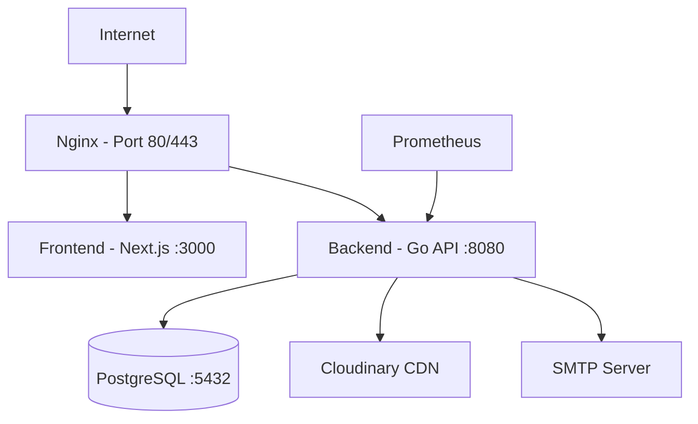
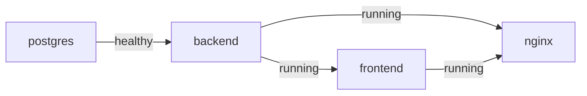
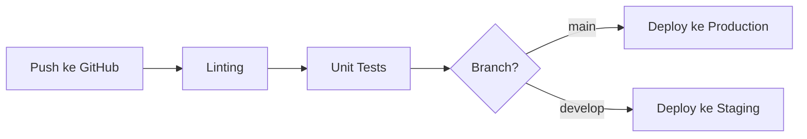

# DevOps & Infrastructure

Infrastruktur Platform Kos dirancang untuk deployment yang mudah, monitoring real-time, dan skalabilitas.

## Arsitektur Deployment



## Containerization: Docker

Seluruh stack di-containerkan dengan Docker.

### Backend Dockerfile (Multi-stage Build)

```dockerfile
# Dari be/Dockerfile

# Build Stage
FROM golang:1.23-alpine AS builder

WORKDIR /app
RUN apk add --no-cache git

# Copy & download dependencies
COPY go.mod go.sum ./
RUN go mod download

# Copy source & build
COPY . .
RUN CGO_ENABLED=0 GOOS=linux go build -o main ./cmd/api

# Final Stage — image kecil (hanya binary)
FROM alpine:latest
WORKDIR /app
COPY --from=builder /app/main .
EXPOSE 8080
CMD ["./main"]
```

Sumber: [`be/Dockerfile`](file:///c:/Users/Arkan/Documents/coding/platfrom-kos/be/Dockerfile)

> **Hasil**: Image production hanya berisi binary Go (~15MB), tanpa source code atau build tools.

### Docker Compose

Orchestrasi 4 container sekaligus:

```yaml
# Dari docker-compose.yml

version: '3.8'

services:
  # PostgreSQL Database
  postgres:
    image: postgres:15-alpine
    container_name: koskosan-db
    restart: unless-stopped
    environment:
      POSTGRES_USER: ${DB_USER}
      POSTGRES_PASSWORD: ${DB_PASSWORD}
      POSTGRES_DB: ${DB_NAME}
    volumes:
      - postgres_data:/var/lib/postgresql/data
      - ./be/migrations:/docker-entrypoint-initdb.d
    ports:
      - "5432:5432"
    healthcheck:
      test: ["CMD-SHELL", "pg_isready -U ${DB_USER}"]
      interval: 10s
      timeout: 5s
      retries: 5

  # Backend API
  backend:
    build:
      context: ./be
      dockerfile: Dockerfile
    container_name: koskosan-backend
    restart: unless-stopped
    environment:
      DB_HOST: postgres
      JWT_SECRET: ${JWT_SECRET}
      # ... env vars lainnya
    ports:
      - "8080:8080"
    depends_on:
      postgres:
        condition: service_healthy
    healthcheck:
      test: ["CMD", "wget", "--spider", "http://localhost:8080/api/health"]
      interval: 30s

  # Frontend (Next.js)
  frontend:
    build:
      context: ./fe
      dockerfile: Dockerfile.prod
    container_name: koskosan-frontend
    ports:
      - "3000:3000"
    depends_on:
      - backend

  # Nginx Reverse Proxy
  nginx:
    image: nginx:alpine
    container_name: koskosan-nginx
    ports:
      - "80:80"
      - "443:443"
    volumes:
      - ./nginx/nginx.conf:/etc/nginx/nginx.conf:ro
      - ./nginx/ssl:/etc/nginx/ssl:ro
    depends_on:
      - backend
      - frontend

volumes:
  postgres_data:
    driver: local
```

Sumber: [`docker-compose.yml`](file:///c:/Users/Arkan/Documents/coding/platfrom-kos/docker-compose.yml)

### Dependency & Health Check Flow



- **postgres** harus healthy sebelum backend start
- **backend** harus running sebelum frontend dan nginx start

## CI/CD Pipeline (GitHub Actions)

Setiap code push menjalani pipeline:



### Langkah CI/CD

1. **Linting**
   - Backend: `golangci-lint run`
   - Frontend: `npm run lint` (ESLint)

2. **Unit Testing**
   - Backend: `go test ./...`
   - Frontend: `npm test` (Playwright)

3. **Automated Deployment**
   - Push ke `main` → trigger webhook ke production server
   - Server menjalankan `deploy.sh`

## Monitoring: Prometheus

Prometheus terintegrasi langsung ke Gin router untuk monitoring real-time:

```go
// Dari be/internal/routes/routes.go
p := ginprometheus.NewPrometheus("gin")
p.Use(router)
```

Metrics yang di-track:

| Metric | Deskripsi |
|--------|-----------|
| `gin_request_duration_seconds` | Latency per endpoint |
| `gin_requests_total` | Total request count |
| `gin_request_size_bytes` | Request body size |
| `gin_response_size_bytes` | Response body size |

Akses metrics: `GET http://localhost:8080/metrics`

## Logging

Backend menggunakan custom logger (`utils.GlobalLogger`) dengan level:

```go
utils.GlobalLogger.Info("Server started on port %s", cfg.Port)
utils.GlobalLogger.Error("Failed to auto-cancel bookings: %v", err)
```

Docker logging dikonfigurasi dengan:
```yaml
logging:
  driver: "json-file"
  options:
    max-size: "10m"    # Max 10MB per log file
    max-file: "3"       # Simpan max 3 file (rotasi otomatis)
```

## Deployment Command

```bash
# Deploy seluruh stack
./deploy.sh

# Atau manual via Docker Compose
docker compose up --build -d

# Cek status
docker compose ps

# Lihat logs
docker compose logs -f backend
docker compose logs -f frontend
```

## Makefile Commands

```makefile
# Dari be/Makefile

make run          # go run cmd/api/main.go
make build        # go build -o bin/main cmd/api/main.go
make docker-up    # docker compose up --build -d
make docker-down  # docker compose down
make lint         # golangci-lint run
```

Sumber: [`be/Makefile`](file:///c:/Users/Arkan/Documents/coding/platfrom-kos/be/Makefile)

---

> [!NOTE]
> Script `deploy.sh` secara otomatis menangani database migration dan container restart. Untuk SSL setup, gunakan `setup-ssl.sh`.
