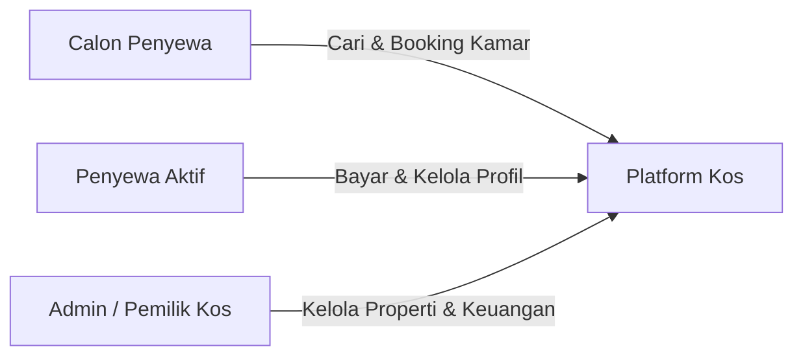

# Introduction

## Tentang Platform Kos

**Platform Kos** adalah aplikasi web manajemen kos-kosan modern yang mendigitalisasi seluruh proses pengelolaan properti kos — mulai dari pencarian kamar, pemesanan, pembayaran, hingga manajemen admin. Dibangun dengan arsitektur **Go (Backend)** + **Next.js (Frontend)**, platform ini menghadirkan pengalaman yang cepat, aman, dan elegan.

## Fitur Utama

| Fitur | Deskripsi |
|-------|-----------|
| 🏠 **Room Browsing** | Cari & filter kamar berdasarkan tipe, harga, dan ketersediaan |
| 📅 **Booking System** | Reservasi kamar dengan atomic transaction |
| 💳 **Payment** | Transfer bank + Cash, upload bukti bayar, konfirmasi admin |
| 🔐 **Authentication** | Login/Register, Google OAuth, HttpOnly cookie JWT |
| 📊 **Admin Dashboard** | Kelola kamar, penyewa, pembayaran, laporan keuangan |
| 🖼️ **Gallery** | Galeri foto properti dengan Cloudinary CDN |
| ⭐ **Reviews** | Sistem ulasan dari penyewa yang terverifikasi |
| 🔔 **Reminders** | Pengingat otomatis pembayaran bulanan via email |

## Target Pengguna

- **Calon Penyewa** — Menjelajahi kamar, melihat detail & review, melakukan booking.
- **Penyewa Aktif** — Mengelola pembayaran bulanan, perpanjangan sewa, dan profil.
- **Admin / Pemilik Kos** — Mengelola kamar, memantau keuangan, dan konfirmasi pembayaran.

## Tujuan Proyek

1. **Transparansi** — Ketersediaan kamar real-time dan harga yang jelas.
2. **Keamanan** — Autentikasi enterprise-grade dengan HttpOnly cookies dan IDOR protection.
3. **Pengalaman Modern** — Antarmuka cepat, responsif, dan mobile-friendly.
4. **Otomasi** — Pengingat pembayaran otomatis dan auto-cancel booking expired.

## Navigasi Dokumentasi

| Bab | Link | Topik |
|-----|------|-------|
| 2 | [Tech Stack](tech-stack.md) | Teknologi yang digunakan |
| 3 | [Project Setup](project-setup.md) | Tutorial setup dari nol |
| 4 | [Architecture](../architecture/overview.md) | Arsitektur clean architecture |
| 5 | [Database](../architecture/database.md) | Model, ERD, dan migration |
| 6 | [Security & Auth](../security/authentication.md) | Autentikasi dan keamanan |
| 7 | [API Reference](../features/api-reference.md) | Daftar endpoint lengkap |
| 8 | [Core Features](../features/core-features.md) | Fitur utama dengan kode |
| 9 | [Frontend](../features/frontend.md) | Arsitektur frontend |
| 10 | [DevOps](../devops/infrastructure.md) | Docker, CI/CD, monitoring |
| 11 | [Conclusion](../conclusion.md) | Roadmap & penutup |

---

> [!TIP]
> Dokumentasi ini ditujukan untuk developer, stakeholder, dan system administrator. Untuk memulai development, langsung ke [Project Setup](project-setup.md).
