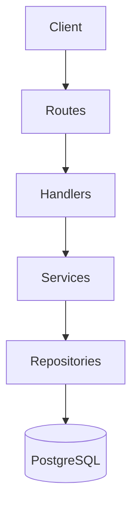

# 3. Architecture

Platform Kos follows a **Clean Architecture** pattern on the backend and a **Modular Hook-based** pattern on the frontend to ensure scalability and maintainability.

## Backend: Clean Architecture
The backend is structured into three distinct layers:

1. **Handlers (Transport Layer)**:
   - Responsible for parsing HTTP requests (Gin) and validating basic input.
   - Example: `handlers.BookingHandler.CreateBooking`.

2. **Services (Business Logic Layer)**:
   - Contains the core logic, domain rules, and orchestrates repository calls.
   - Example: `service.BookingService.CreateBookingWithProof`.

3. **Repositories (Data Layer)**:
   - Handles absolute database operations using GORM.
   - Example: `repository.KamarRepository`.

## Frontend: Modular UI
The frontend uses a modern React pattern where UI and logic are strictly separated:

* **Views**: Purely visual components located in `views/`.
* **Custom Hooks**: All business logic, state management, and data fetching are encapsulated in `hooks/`.
* **SWR**: Used for efficient data synchronization and caching.

---

> [!NOTE]
> This separation allows us to swap UI components (e.g., changing from a grid to a list) without touching the underlying data logic.
