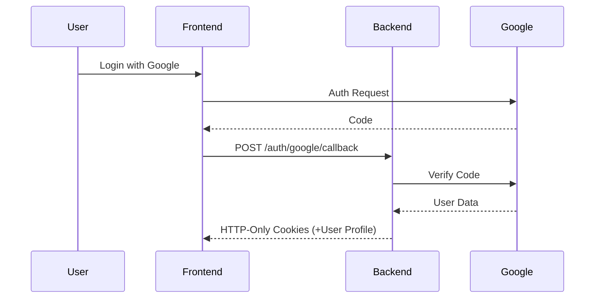

# 4. Security & Authentication

Security is at the heart of Platform Kos. We implement enterprise-grade protection across all layers.

## Authentication Flow
We use a **Double-Token HttpOnly** strategy:

1. **Access Token**: Stored in an `HttpOnly`, `Secure` cookie. Invisible to JavaScript, mitigating XSS risks.
2. **Refresh Token**: Used to automatically rotate access tokens without forcing a user logout.
3. **Google OAuth2**: Integrated for easy and secure third-party authentication.



## Authorization & IDOR Protection
To prevent **Insecure Direct Object Reference (IDOR)**, every request owner is verified against the resource they are trying to access.

```go
// Example logic in BookingService.go
if booking.PenyewaID != currentUserID {
    return fmt.Errorf("unauthorized access")
}
```

## Security Checklist
- [x] **Rate Limiting**: Brute-force protection on `/login` and `/register`.
- [x] **CSRF Mitigation**: Samesite cookie attributes and custom headers.
- [x] **Cloudinary Enforcement**: No local file execution; all media is served from a secure CDN.
- [x] **Input Sanitization**: Strict validation on all GORM models.

---

> [!WARNING]
> Never store tokens in `localStorage`. Always use the `apiCall` helper which automatically handles the HttpOnly cookie handshake.
