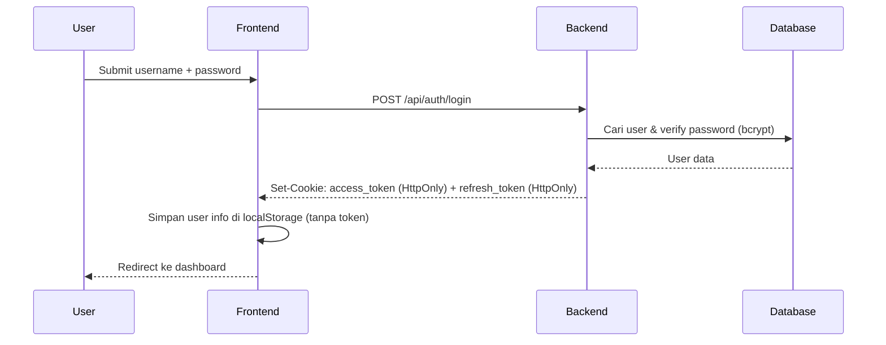
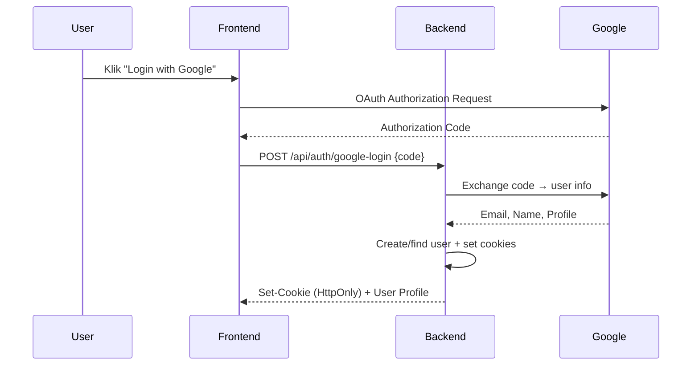

# Security & Authentication

Security adalah prioritas utama Platform Kos. Berikut implementasi keamanan yang diterapkan di setiap layer.

## Authentication Flow

Platform Kos menggunakan strategi **Double-Token HttpOnly Cookie**:

1. **Access Token** — Disimpan di cookie `HttpOnly` + `Secure`. Tidak bisa diakses JavaScript → mitigasi XSS.
2. **Refresh Token** — Untuk merotasi access token secara otomatis tanpa logout.
3. **Google OAuth2** — Login via akun Google tanpa perlu password.

### Sequence Diagram: Login



### Sequence Diagram: Google OAuth



## Auth Middleware

Middleware JWT yang membaca token dari HttpOnly cookie:

```go
// Dari be/internal/middleware/auth.go

func AuthMiddleware(cfg *config.Config) gin.HandlerFunc {
    return func(c *gin.Context) {
        // Get token dari cookie (prioritas) atau Authorization header (fallback)
        token, err := utils.GetAuthToken(c)
        if err != nil {
            utils.UnauthorizedError(c, "Missing authentication token")
            c.Abort()
            return
        }

        // Validate ACCESS token specifically (not refresh token)
        claims, err := utils.ValidateAccessToken(token, cfg.JWTSecret)
        if err != nil {
            utils.UnauthorizedError(c, "Invalid or expired token")
            c.Abort()
            return
        }

        // Set claims ke context untuk digunakan di handlers
        c.Set("user_id", claims.UserID)
        c.Set("username", claims.Username)
        c.Set("role", claims.Role)

        c.Next()
    }
}
```

Sumber: [`be/internal/middleware/auth.go`](file:///c:/Users/Arkan/Documents/coding/platfrom-kos/be/internal/middleware/auth.go)

## Role-Based Access Control (RBAC)

Middleware yang memastikan hanya user dengan role tertentu yang bisa mengakses endpoint:

```go
// Dari be/internal/middleware/auth.go

func RoleMiddleware(allowedRoles ...string) gin.HandlerFunc {
    return func(c *gin.Context) {
        userRole, exists := c.Get("role")
        if !exists {
            utils.ForbiddenError(c, "User role not found")
            c.Abort()
            return
        }

        role := userRole.(string)
        roleAllowed := false
        for _, allowedRole := range allowedRoles {
            if role == allowedRole {
                roleAllowed = true
                break
            }
        }

        if !roleAllowed {
            utils.ForbiddenError(c, "You don't have permission to access this resource")
            c.Abort()
            return
        }

        c.Next()
    }
}
```

Penggunaan di routes:

```go
// Admin routes - hanya role "admin" yang bisa akses
admin := protected.Group("")
admin.Use(middleware.RoleMiddleware("admin"))
```

## Auto-Refresh Token (Frontend)

Frontend secara otomatis me-refresh token yang expired tanpa mengganggu user:

```typescript
// Dari fe/app/services/api.ts

const apiCall = async <T>(method: string, endpoint: string, body?: unknown): Promise<T> => {
    const config: RequestInit = {
        method,
        headers: { 'Content-Type': 'application/json' },
        credentials: 'include', // PENTING: Kirim HttpOnly cookies
    };

    if (body) {
        if (body instanceof FormData) {
            delete (config.headers as Record<string, string>)['Content-Type'];
            config.body = body;
        } else {
            config.body = JSON.stringify(body);
        }
    }

    const res = await fetch(`${API_URL}${endpoint}`, config);

    // Handle token refresh otomatis pada 401
    if (res.status === 401 && endpoint !== '/auth/refresh' && endpoint !== '/auth/login') {
        const refreshed = await refreshAccessToken();
        if (refreshed) {
            return apiCall<T>(method, endpoint, body); // Retry request
        }
        // Refresh gagal → redirect ke login
        if (typeof window !== 'undefined') {
            localStorage.clear();
            window.location.href = '/login';
        }
    }

    return safeJson(res);
};
```

Sumber: [`fe/app/services/api.ts`](file:///c:/Users/Arkan/Documents/coding/platfrom-kos/fe/app/services/api.ts)

## IDOR Protection

Setiap request ke resource yang sensitif divalidasi ownership-nya. Contoh pada Booking:

```go
// Contoh di BookingService
if booking.PenyewaID != currentUserID {
    return fmt.Errorf("unauthorized access")
}
```

User A **tidak bisa** mengakses/memodifikasi data booking milik User B, meskipun mereka menebak ID booking.

## Rate Limiting

Brute-force protection pada endpoint sensitif:

```go
// Dari be/internal/routes/routes.go
auth := api.Group("/auth")
{
    // Rate limit ketat untuk login & register
    auth.POST("/login", middleware.StrictRateLimit(), r.authHandler.Login)
    auth.POST("/register", middleware.StrictRateLimit(), r.authHandler.Register)
    auth.POST("/google-login", middleware.StrictRateLimit(), r.authHandler.GoogleLogin)
    auth.POST("/forgot-password", middleware.StrictRateLimit(), r.authHandler.ForgotPassword)
    auth.POST("/reset-password", middleware.ModerateRateLimit(), r.authHandler.ResetPassword)
}
```

## Security Checklist

| Perlindungan | Status | Detail |
|-------------|--------|--------|
| HttpOnly Cookies | ✅ | Token tidak bisa diakses JavaScript |
| Refresh Token Rotation | ✅ | Auto-rotate tanpa logout |
| Rate Limiting | ✅ | `/login`, `/register`, `/forgot-password` |
| CSRF Mitigation | ✅ | SameSite cookie attribute + `credentials: 'include'` |
| IDOR Protection | ✅ | Ownership check pada semua resource sensitif |
| Input Validation | ✅ | Validasi di handler + GORM model constraints |
| Password Hashing | ✅ | bcrypt hashing |
| Cloudinary Enforcement | ✅ | Media via CDN, tidak ada file execution lokal |
| Soft Delete | ✅ | Data tidak dihapus permanen |
| JWT Secret Validation | ✅ | Minimum 32 karakter, wajib di-set |

## Konfigurasi Security

Dari `config.go`, validasi wajib saat startup:

```go
// Dari be/internal/config/config.go

func (c *Config) ValidateRequired() error {
    if c.JWTSecret == "" {
        return fmt.Errorf("JWT_SECRET environment variable is required")
    }
    if len(c.JWTSecret) < 32 {
        return fmt.Errorf("JWT_SECRET must be at least 32 characters long for security")
    }
    if c.DBPassword == "" {
        log.Println("WARNING: DB_PASSWORD is empty. This is insecure for production!")
    }
    return nil
}
```

---

> [!WARNING]
> **JANGAN** simpan token di `localStorage`. Selalu gunakan helper `apiCall` dari `api.ts` yang secara otomatis mengirim HttpOnly cookies.
